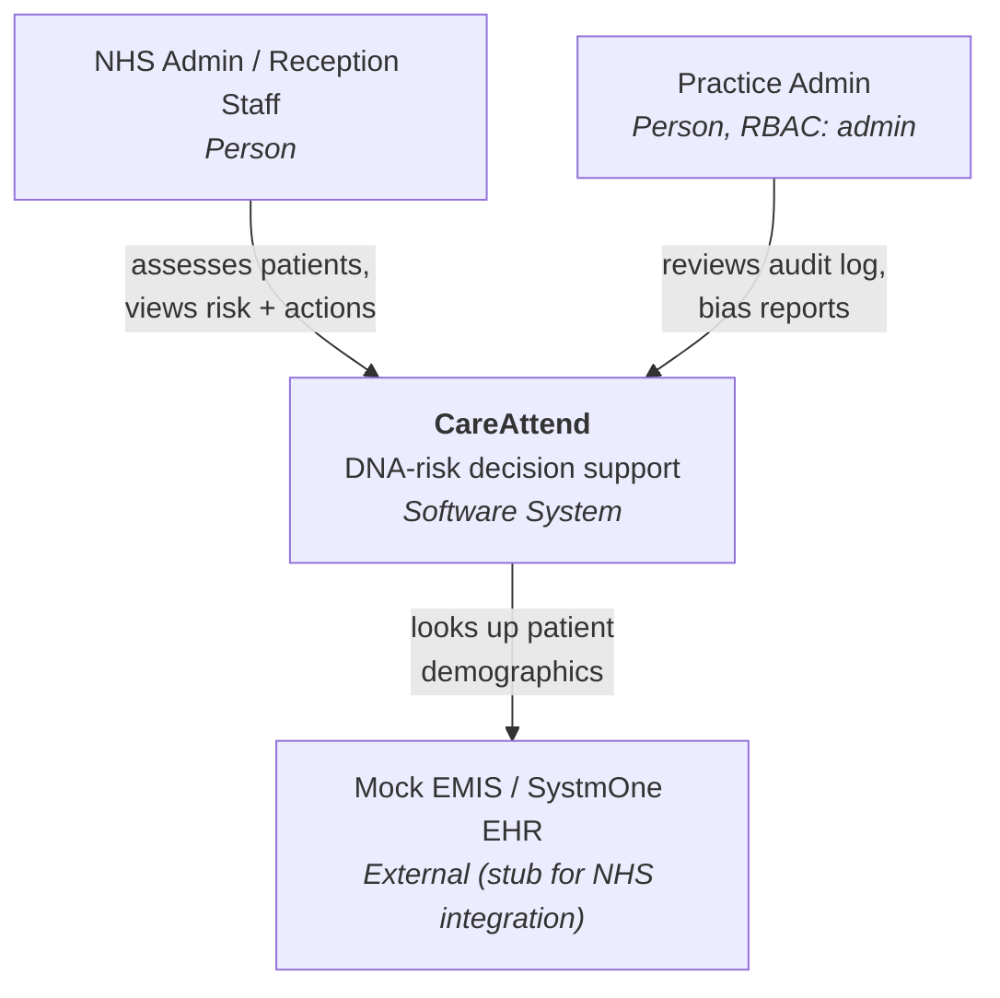
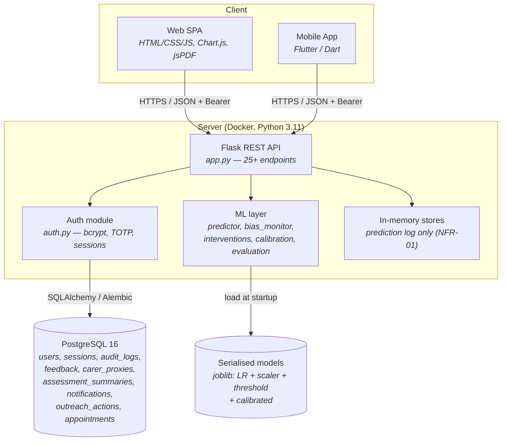
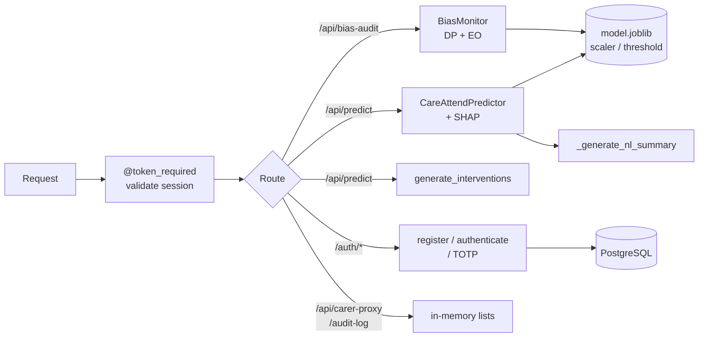
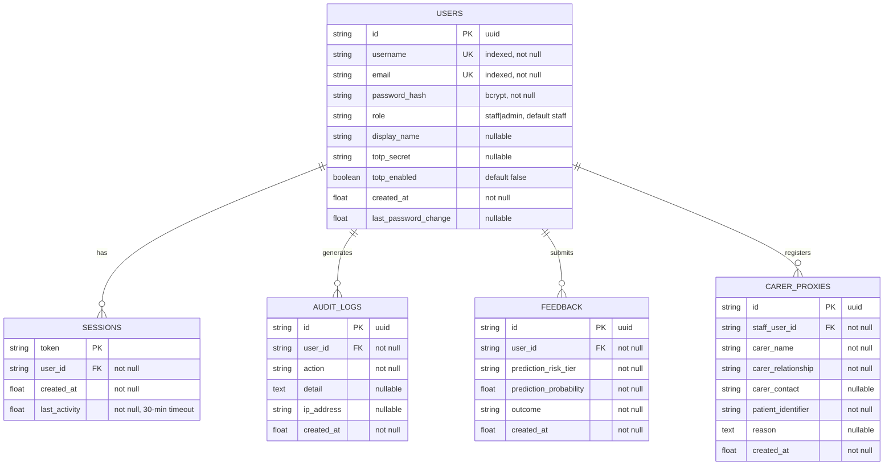

# CareAttend — Architecture (C4) & Data Model

*Diagrams in Mermaid (render on GitHub / VS Code). Built from the actual code — the ERD is a 1:1 reflection of `backend/models.py`, verified June 2026. Use for the AT2 Software Definition (design) section.*

---

## C4 Level 1 — System Context



## C4 Level 2 — Containers



## C4 Level 3 — Component (Flask API internals)



---

## Entity-Relationship Diagram (matches `models.py` exactly)



**Note on NFR-01:** there is intentionally **no patient table**. Prediction inputs/outputs are processed in memory and never persisted, satisfying the privacy/data-minimisation requirement (GDPR Art 5(1)(c)). Operational workflow data now persists in PostgreSQL: assessments, notifications, appointments, outreach actions, anonymised feedback, carer-proxy admin records, users, sessions, and audit logs.

---

## ✅ Resolved deviation (AT4 critical-appraisal material)

**Original issue (June 2026):** the ORM models `AuditLog`, `PersistentFeedback`, and `CarerProxy` existed with Alembic migrations, but the live endpoints wrote to **process-memory lists**, so audit/feedback/proxy records did not survive a restart — an audit trail you can wipe by restarting is not an audit trail.

**Fix applied:** the endpoints now persist to PostgreSQL via the existing models:
- `/api/carer-proxy` → `CarerProxy` row (+ an `AuditLog` row) — `app.py::create_carer_proxy`.
- `/api/carer-proxy/list` → query `CarerProxy` scoped by `staff_user_id`.
- `/api/audit-log` (admin) → query `AuditLog`, newest 100.
- `/api/feedback` → writes an **anonymised** `PersistentFeedback` row (tier, probability, outcome — no patient data, NFR-01 safe) + an `AuditLog` row.
- New `_audit(user_id, action, detail)` helper records actor + `ip_address`.

**Still intentionally in-memory:** `_prediction_log` (patient prediction inputs/outputs) — session-scoped per NFR-01, never persisted. The new appointment/outreach/outcome workflow is persisted.

**Tests:** persistence asserted in `test_new_endpoints::TestCarerProxy::test_create_writes_audit_entry` and `test_feature_coverage::TestFeedback::test_feedback_persisted_to_db`.

> **Report narrative:** present this as "identified during architectural review, then remediated" — shows the self-critique → fix loop examiners reward, while keeping the honest data-minimisation distinction (operational data persists; patient data does not).
```
```
